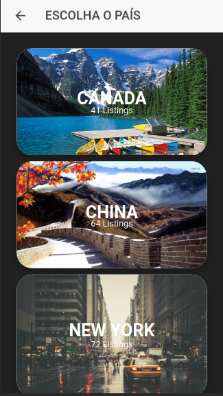
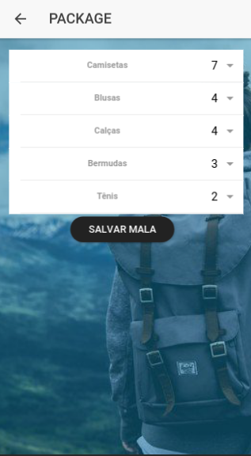

# Projeto Package

### Start Projeto
```
 > npm install
 > ionic serve
```

#### Dados da aplicação
```
Frontend -  Ionic 3 - Bootstrap 3 - Angular 5
```         

#### Aplicação para viajantes, um aplicativo para montar sua mala
#### de acordo com o país que você vai viajar e também com a estação.
#### O usuário poderá escolher país


#### Escolher a estação que irá viajar e montar sua mala pelo aplicativo




